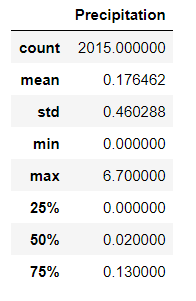
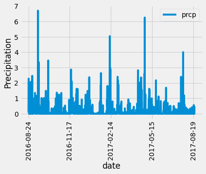
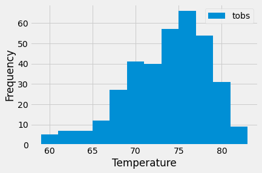

# sqlalchemy-challenge
## GA Tech Data Science and Analytics Module 10

This module utilizes a mix of tools such as Python, SQLAlchemy, Pandas, Matplotlib, and Flask to perform a basic analysis and data exploration of a provided SQLite database.

### Description: Part 1: Climate Analysis and Exploration

<b>Precipitation Analysis</b>

For this part, we analyze the precipitation data of the previous 12 months.

We then plot the data onto a graph:

Based on the graph, we can see that the months of August, February, and May appear to see the most rainfall.

<b>Station Analysis</b>

For this part, we analyze the station table by identifying the station with the most activity. To do this, we calculate the total number of rows in the dataset for a given station.

We find that station USC00519281 is the most active station.

Then we calculate the lowest, highest, and average temperatures of the most active station. We find that the lowest temperature is 54.0, the highest temperature is 85.0, and the average temperature is 71.66.

As we continue to analyze the data for the most active station, we identify the temperatures for the previous year and plot this onto a histogram to display the frequency of a given temperature.

Based on the histogram, we can conclude that the distribution of temperatures fall around 75.

### Description: Part 2: Design Your Climate App

For this part, we use Flask to create API calls for the data that we created queries for in Part 1.

Here are the available routes that we needed to create:

* /api/v1.0/precipitation
* /api/v1.0/stations
* /api/v1.0/tobs
* /api/v1.0/[start: yyyy-mm-dd]
* /api/v1.0/[start: yyyy-mm-dd]/[end: yyyy-mm-dd]

The precipitation route lists the dates and precipitation of all results in the database as a dictionary.

The stations route lists the stations from the station table.

The tobs route lists the temperatures of the previous year from the latest year in the dataset.

The start route is a dynamic API that will calculate the temperature min, max, and avg of all results starting from the given date to the end date in the dataset. This route assumes that the input will be in yyyy-mm-dd format.

The start/end route is a dynamic API that will calculate the temperature min, max, and avg of all results starting from the given date to the given end date. This route assumes that the input will be in yyyy-mm-dd format.

The current code will only verify if the end date is after the start date. It will not validate if the date exists in the dataset.

### Submission Requirements:
* Initial data resources provided for module
* Flask app.py file
* Jupyter Notebook with analysis

Though two bonuses are provided as an option to complete, they were not completed at time of module submission.
